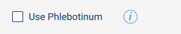

## Adding Help Information to Extension Interfaces

It can greatly enhance the user experience if key information is available as on-screen help, rather than forcing users to leaf through manuals or hit their favourite search engine.

Help information popup windows that display rich text can be added to YML using the `HelpButton` item.

For example, to add help for a `CheckBox` you like the help icon to the right like this:



which can be achieved with the YML:

```qml
    Row {
        align: Const.Center

        CheckBox {
            text: "Use Phlebotinum"
        }

        HelpButton {
            title: "Phlebotinum Use"
            htmlSource: "html/en/help-phlebotinum.html"
        }
    }
```

When the help 'info' icon is clicked, a popup will open displaying the HTML file content:

{:width="50%"}

The HTML help files may only emply a limited subset of HTML elements.  See documentation for the `Text` item [text](yml-reference.html#text) for detail.  Images may be referenced via the HTML `img` element `src` attribute, but should be relative images path from the location of the `.html` file.

### Registering HTML files

In order for the pendant YML engine to locate your HTML files, they must be regsitered via a call to `registerHTMLFile()`:

```java
        pendant.registerHTMLFile("html/en/help-phlebotinum.html");
```

While the `.html` files may be located anywhere, it is good practice to place them in a `html` subdirectory (and within a language-code subdirectory if you anticipate selecting which file to register based on the current pendant language).

Note that any images referenced by `img` `src` attributes must also be registered, just as for images used by the `Image` YML item.  Hence:
```java
    pendant.registerImageFile("html/en/phlebotinum.png");
```
will be required for the image to appear in the help popup.

`help-phlebotinum.html`:
```html
<h3>Use of Phlebotinum</h3>

<p>When enabled, phlebotinum will be automatically applied by the tool to the workpiece.  
    This will enhance the AI inspection camera's ability to recognize the workpiece correctly.</p>
<p>Note that contact of phlebotinum with hands and eyes should be avoided as adverse mental states may result.</p>
<p>
    <br>
    <i>(refer to safety data sheet for further details)</i>
</p>
```

