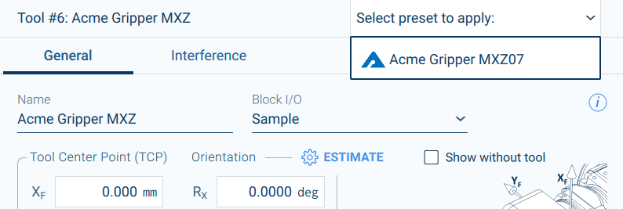
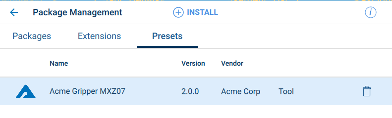

## Creating Tool Property Presets

With Yaskawa robot controllers, the notion of a *tool* includes not only the end-of-arm tooling, but any possible payload that may be present.  The reason for this is that to perform efficient and high-speed motions, the controller must understand the dynamics of the arm with payload, which includes the mass distribution of the tool and payload.

For that reason, the user will often define multiple 'tools' that include the same end-of-arm tooling but with different payloads - such as a set of tool properties for an empty gripper, one with one part and one with another part, for example.  Having to enter similar property values manually for each tool setting can be tedious.

For Smart Series robots, or any robot utilizing an FSU (Functional Safety Unit), safety certification requires that there is a manual read-back, verification and write process to update safety critical parameters such as tool properties.  For this reason, it isn't possible to allow extension code to directly modify tool properties online.

### Tool Presets

To make creation of tool properties easier for the user, the Smart Pendant allows importing *Presets*, which are specifications of settings, such as tool properties, that can be stored for later use as a 'template' for use by the user when actually defining new tool property settings.  When the wishes to create new tool properties, that can select the available presets to apply and the properties will be pre-filled as if they were manually edited.  The user will still need to save the settings (hence triggering the safety read-back/verify/write process when using FSU enabled robot controllers).

Selecting a Tool preset:

{:width="80%"}

Installed Presets Management:

{:width="80%"}


A preset file is a plain text file, with a `.yps` extension.  For example:

`acme-tool.yps`:
```jsonnet
{
    filetype: "presets",
    created: "2020-10-20 18:50:30",
    displayNames: {
        en: "Acme Gripper MXZ07"
    },
    vendor: "Acme Corp",
    icon: "data:image/png;base64,iVBOR...kJggg==",
    presets: [
        {
            preset: "tool",
            id: "com.acme.demo.preset-tool",
            displayNames: {
                "en": "Acme Gripper MXZ07"
            },
            version: "2.0.0",
            weight: 3.1,
            offset: [0.3, 0.2, 0.25 ],
            orient: [0.0, 8.1, 0.2],
            com: [0.1, 0.1, 0.1 ],
            moi: [0.111, 0.111, 0.121],
            blockIO: "Sample"
        }
    ]
}
```

Detailed documentation on the Yaskawa Presets format is available [here](preset-files.html).

Preset files can be included in Yaskawa Install Package (.yip) files for installation with your extension.

Note that is is possible to specify the name of an associated Block I/O, which can associate some INFORM commands with states of the tool (e.g. some I/O commands for ON and OFF states corresponding to opening and closing a gripper, for example).  The Block I/O commands themselves cannot currently be included in the preset file, but Block I/O can be installed via the Tools component of Yaskawa Install Packages - and hence could be bundled in a package that also installs the extension.

