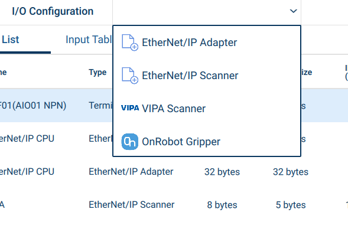

# Yaskawa Preset Files 
  (*YII draft 2 2020-10-14* - Internal Use Only)

## Contents

 * [General format](#general-format)
 * [Common Preset Entries](common-preset-entries)
 * [Tool Presets](#tool-presets)
 * [Ethernet/IP Presets](#ethernet-ip-presets)
 * [Advanced Preset files](#advanced-preset-files)
 * [Preset Icons](#preset-icons)

When entering settings on the Smart Pendant, it often occurs that many settings are repeated and have reasonable default values, for which re-entry could be avoided.  For this reason, the Smart Pendant supports collecting some settings into simple *Preset* Files (.yps), which can be loaded and subsequently used as a template for entering settings.  Currently, Smart Pendant supports Tool and Ethernet/IP scanner & adapter presets.

For example, settings for a tool require entering several values, including tool center-of-mass, weight, moment-of-inertia values and others.  Typically, tool settings for various different payload weights are created.  For a particular technology partner's tool, many of these settings are fixed & repeated.  Hence, if a partner creates and supplies a *Tool Preset* file, this can be installed onto the Smart Pendant and then the preset will always be available as a starting point when creating new tool settings on-screen.  A similar situation exists for setting up devices for communication via the Ethernet/IP fieldbus.

## General format

Here is an example .yps preset file for an Ethernet/IP Scanner (which will be detailed in the subsequent sections):
```json
// EIP scanner device preset
{
  filetype: "presets",
  presets: [
    {
      preset: "ethip-scanner",
      id: "com.acme.eip.scanner1",
      vendor: "Acme Inc",
      icon: "acme-logo-256x256.png",
      displayNames: {
        en: "Acme Gripper",
        ja: "Acmeグリッパー"
      },
      ininst: 40,
      insize: 24,
      outinst: 41,
      outsize: 16
    }    
  ]
}
```
Firstly, outside of quotes, spaces are not significant to the software, so the indentation is a convention to make things easier for people to read.  In addition, anything after "//" to the end of a line will be ignored, as a way to include comments for human readability.

The Preset format consists of a *dictionary*, which is a set of field *name*`:` *value* pairs, separated by commas and enclosed in `{` and  `}`.  Above, you can see field names such as `vendor`, `insize` and others.  The order of the dictionary entries is not significant.  Field names are not case-sensitive.  The values can be literal character strings enclosed in double-quotes, such as `"Acme Inc."`, decimal or whole number (integer) values, such as `1.2` or `40`, or the special values `true` and `false` for boolean flags.  

*Lists* are also supported, by separating values by commas and enclosing them in `[` and `]`.

Values in general can themselves also be dictionaries or lists.  Hence, it is possible to nest - such as above where the whole file is a dictionary (starts with `{`), with a `presets` entry for which the value is a `list` containing a nested dictionary containing the `displayNames` entry which has a dictionary for its value.

Looking at the presets file, we see that it is a dictionary with the entries `filetype` and `presets`.  The `filetype` must always be `"presets"` to identify this file as a presets file.  As you may have guessed from the name `presets` (plural), it is possible to include multiple presets in a single file, although the one above only has a single preset (though it is still a list enclosed by `[` and `]` even though it is just a list of one element).

## Common Preset Entries

Some preset entries are common across presets types.  These are:
* `preset` - the type of preset in this dictionary.  One of `tool`, `ethip-scanner` or `ethip-adapter`
* `id` - this must be a unique identifier that is used by the software to identify this particular preset.  The installer will use this to keep track of the presets installed.  It is only used by the software and isn't shown to the user of the pendant normally.  It is recommended to use a reverse domain style id, of the form <tld>.<company>.<departement>.<product> where <tld> is typically "com", "org", "edu", "gov" etc.  For example, Yaskawa might use "com.yaskawa.robotics.motosight.camera". (Note that is not related to an actual domain, so no web domain need be owned)
* `vendor` - this is the name of the device vendor, as displayed on the pendant.  As with all character strings, UTF-8 Unicode encoding is assumed.
* `displayNames` - A name for the device (optionally in multiple languages).  Will be displayed on the pendant as the preset name for selection when creating a new EtherNet/IP device.  Used as the preset/pre-filled name for a new device upon creation, but truncated to 16 characters.  
  As the Smart Pendant is a global product used in multiple languages, rather than a single string name, this is a dictionary where each field name is a language code and the value is the name that will be displayed when that language is in use.  It is recommended to always have an `en` entry for English as a fall-back in case the file is used in a language region for which you didn't specify a translation.  The entries should use ISO 639-1 two-letter language codes.
* `version` - each preset can optionally provide a version.  If omitted, version `"1.0.0"` is assumed.  By default, the pendant will not re-install presets that are already installed (as determined by the `id` and `version` pair).  To update a preset, either increase the version (e.g. from "1.0.0" to "1.0.1") or delete the installed presets first.  Versions follow the [Semantic Versioning format (semver.org)](https://semver.org/).
* `icon` - this can either be the name of a .png or .jpg image file, with dimensions 256x256 pixels, assumed to be in the same folder as the .yps presets file, or a data: URI for a png or jpeg to keep the icon data within the file.  It is optional.  *More detail in the section below.*


## Tool Presets

 This is a typical example of a tool preset file:

```json
// Tool settings for Acme Multigrip
{
  filetype: "presets",
  presets: [
    {
      preset: "tool",
      id: "com.acme.tools.multigrip",
      displayNames: { en: "Multi-grip" },
      weight: 1.25,
      offset: [0.0,0.0,250.0],
      orient: [0.0,0.0,0.0] // optional
      com: [0.0,0.0,0,90.0],
      mio: [0.002,0.003,0.001], // Kg.m^2
    }
  ]
}
```

The supported tool preset field entries are:

* `weight` - The weight of the tool (Kg).  Note that on Yaskawa robot controllers, the notion of a 'tool' within a robot program includes the payload.  Hence, it is common for the user to create multiple 'tools' with similar settings but different weight or center-of-mass etc. to represent the tool with different payloads.  Typically, the preset will provide settings for the empty tool which the user can use as a starting point.
* `offset` - Tool Center Point (TCP) offset from the tool mounting plate (millimeters, optional, defaults to `[0.0,0.0,0.0]`)
* orient - Tool Center Point (TCP) orientation offset from the tool mounting orientation (optional, degrees Euler Roll-Pitch-Yaw/Rx,Ry,Rz, defaults to `[0.0,0.0,0.0]`)
* `com` - Center Of Mass(/Gravity) - a list of [x, y, z] coordinates, relative to the tool plate mount origin (mm) 
* `moi` - Moment Of Intertia components (list [Ixx,Iyy, Izz], Kg,m^2^)
* `blockio` - Name of pre-existing pendant Tool Block I/O commands associated with this tool. (optional, quoted name)


## Ethernet/IP Presets

First, the following field entries are Ethernet/IP Scanner settings:

* `preset` - this must have the value `"ethip-scanner"`
* `inInst` - input instance (required, whole number)
* `inSize` - input instance size (optional; defaults to 1)
* `outInst` - output instance (required, whole number)
* `outSize` - output instance size (optional; defaults to 1)
* `configInst` - configuration instance (optional, whole number)
* `configSize` - configuration instance size (optional, defaults to 0)
* `ip` - IP address (IPv4 x.x.x.x format quoted string, optional).  This is often omitted as it may vary for different robot installations and so should be set explicitly by the end user
* `instByteSize` - instance number bytes, 1 or 2 (optional, defaults to 2)
* `connType` - connection type string (one of `"exclusive"`, `"inputonly"` or `"user"`, defaults to `exclusive`)
* `inGroup` - I/O group(byte) number for inputs (optional, whole number, defaults to automatic or user selected) - since this may vary per installation and is often omitted to selected during device creation I/O allocation
* `outGroup` - I/O group(byte) number for outputs (optional, whole number, defaults to automatic or user selected)
* `connRPIot` - Connection RPI Originator to Target in milliseconds (optional whole number, defaults to 20ms)
* `connRPIto` - Connection RPI Target to Originator in milliseconds (optoinal whole number, defaults to 20ms)
* `connRetries` - number of connection retries before timeout error (optional whole number, defaults to 4 times)

For an Ethernet/IP Adapter (one per robot controller), the entries are:
* `preset` - this must have the value `"ethip-adapter"`
* `inInst` - input instance (required, whole number)
* `inSize` - input instance size (optional; defaults to 1)
* `outInst` - output instance (required, whole number)
* `outSize` - output instance size (optional; defaults to 1)
* `configInst` - configuration instance (optional, whole number)
* `configSize` - configuration instance size (optional, defaults to 0)
* `active` - boolean `true` or `false` (optional, defaults `true`)
* `inGroup` - I/O group(byte) number for inputs (optional, whole number, defaults to automatic or user selected) - since this may vary per installation and is often omitted to selected during device creation I/O allocation
* `outGroup` - I/O group(byte) number for outputs (optional, whole number, defaults to automatic or user selected)


## Advanced Preset files

As noted, it is possible to include multiple presets in a single .yps presets file.  These can simply be included by separating each within the presets `[]`list.  When a presets file contains multiple presets, it makes sensor for it to have a name of its own.  This is what will be shown to the user for selection upon installation.

<div style="page-break-after: always"></div>
For example:

```json
// Acme Ethernet/IP and Tool presets
{
  filetype: "presets",
  version: "1.2.0",
  vendor: "Acme Inc",
  icon: "acme-logo-256x256.png",
  displayNames: {
    en: "Acme EIP devices",
    ja: "Acme EIPデバイス"
  },
  presets: [
  {
      preset: "ethip-adapter",
      id: "com.acme.eip.adapter",
      displayNames: {
        en: "Acme Adapter"
      },
      ininst: 40,
      insize: 24,
      outinst: 41,
      outsize: 16,
      configinst: 42,
      configsize: 0
  },
  {
      preset: "ethip-scanner",
      id: "com.acme.eip.scanner1",
      displayNames: {
        en: "Acme Gripper",
        ja: "Acmeグリッパー"
      },
      version: "1.2.0",
      ininst: 40,
      insize: 24,
      outinst: 41,
      outsize: 16,
      configinst: 42,
      configsize: 0
  },
  {
      preset: "tool",
      id: "com.acme.tools.multigrip",
      displayNames: { en: "Multi-grip" },
      weight: 1.25,
      offset: [0.0,0.0,0.25],
      orient: [0.0,0.0,0.0] // optional
      com: [0.0,0.0,0.09],
      mio: [0.002,0.003,0.001], // Kg.m^2
      toolio: "MultiGripOnOffCmds" // optional
      icon: "data:image/png;base64,iVBORw0KGgoAAAANSUhEUgAA...ABJRU5ErkJggg=="
    }
   
}
```

Notice a few changes:

* Instead of listing the `vendor` and `icon` entries for each preset, they're listed in the top level dictionary instead.  This avoids having to repeat them, though they can still be included in each preset - which is useful to override the file-level value.
* The file as a whole, has a `version` entry.  This is shown to users when selecting for installation.  It is inherited by the included presets (though each can have an overridden version by explicitly including a `version` entry in any particular preset dictionary)
* The file has its own `displayNames` entry.  This should name the set of presets collectively, though they are installed and updated separately.
* Icon image data for the tool preset is included in-line, overriding it at the file level (elided for brevity).  See the section below for detail.

## Preset Icons

While optional, it is often desirable to supply a small icon to be associated with a preset.  For example, it may be the logo of the device vendor or a product icon.  This makes it easier for the user to select presets from the list of those available by making presets distinct.

While providing an icon as a 256x256 PNG or JPG image file in the same folder as the preset .yps file is the simplest, it is likely that end-users may inadvertently copy one with without the other, rendering the presets file invalid (uninstallable).  To make the preset files more robust, it is recommended to include the icon data in the presets file itself, as a text-based base64 data: URI - a common web format for images embedded in HTML web pages.

This is not difficult to achieve.  Using an online image to base64 URI converter tool will provide the text that can be pasted into the `icon` entry (within double quotes).

One such website is [www.base64-image.de](https://www.base64-image.de/), although there are many others and also offline tools.  The output will be a long string starting with ``data:image/png;base64,`.  Within the preset it will look something like:

```json
    icon: "data:image/png;base64,iVBORw0KGgoAAAANSUhEUgAA...ABJRU5ErkJggg=="
```

Once installed on the Smart Pendant, the icon will be visible on the user selection menu when creating a new device:

{:height="320px"}
