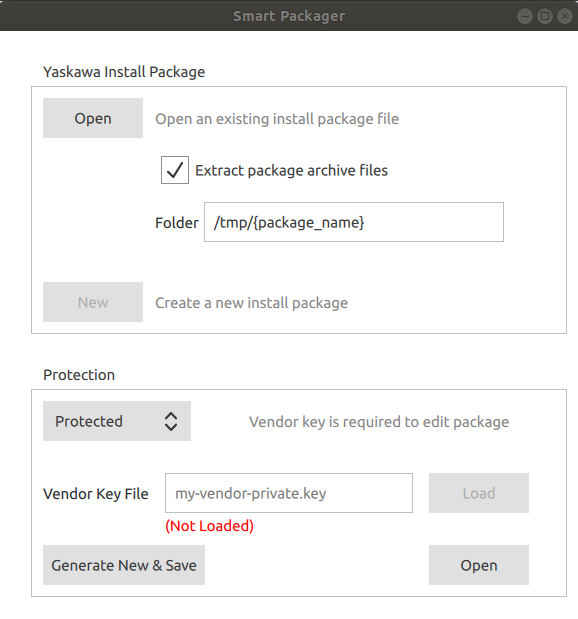
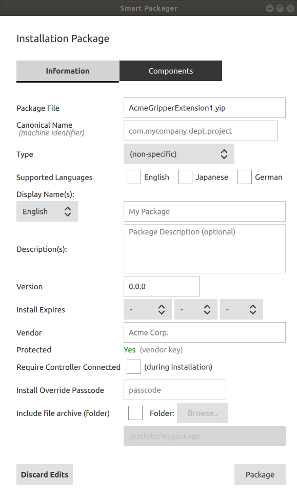
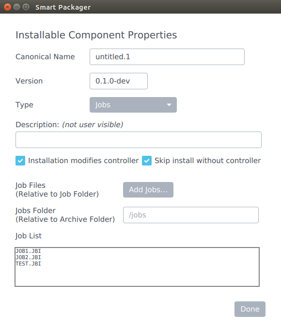
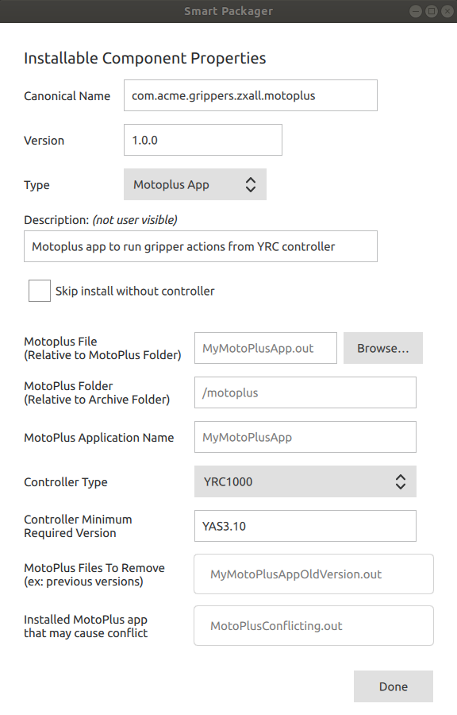
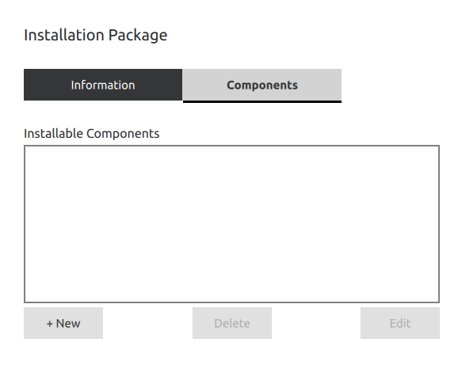
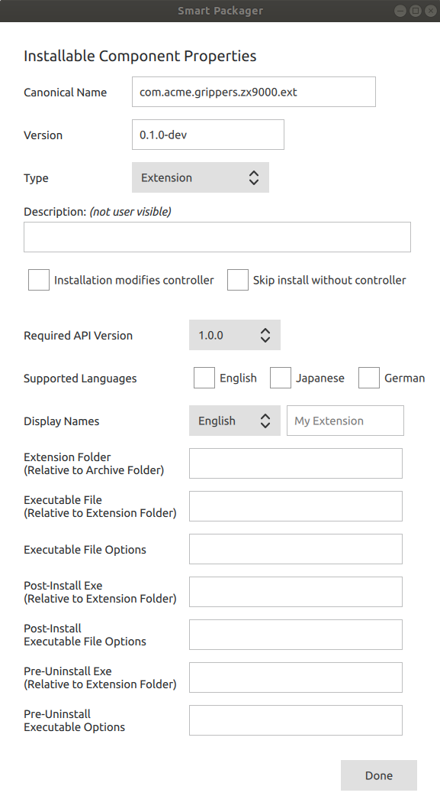

# Smart Packager

## Contents

 * [Concepts](#concepts)
 * [Creating a Package](#creating-a-package)
 * [Components](#components)
   * [Jobs Component](#jobs-component)
   * [I/O Names Component](#i-o-names)
   * [Variables Component](#variables-component)
   * [Tools Component](#tools-component)
   * [MotoPlus Apps Component](#motoplus-apps-component)
   * [Options & Parameters Component](#options-parameters-component)
   * [FieldBus Component](#fieldBus-component)
   * [Network Component](#network-component)
   * [Files Component](#files-component)
   * [Extension Component](#extension-component)
 * [Adding an Extension Component](#adding-an-extension-component)
 * [Testing Package Installation](#testing-package-installation)


The Smart Packager is a desktop tool for creating Yaskawa Install Package (YIP / .yip) files.  These files can combine a number of artifacts into a single convenient file for distribution to an end-user—such as robot INFORM jobs, Tool property presets, I/O names, Smart Pendant Extensions, MotoPlus controller apps and other items.  Currently, the Smart Pendant is required to install `.yip` files.

YIP packages are cryptographically encrypted and signed so they can protect your IP, though may also be explicitly 'unprotected' to allow opening and editing by anyone using Smart Packager.

This is a guide to using the Smart Packager.

<span style="color:orange">This document is a work-in-progress.</span>

First, obtain Smart Packager for Linux by contacting Yaskawa.  

## Concepts

Launch Smart Packager on your desktop.  You will see the main window as below (or similar):



As you can see, there are sections for selecting package protection options and either Opening an existing package, or creating a New package.

First, some key concepts:

 * *Vendor* - this is the name of the vendor (or originator) of the package.  It can be any text string and is shown to users when information about the package is viewed.  Typically, this is the name of your company (e.g. "Acme Robots 'n Stuff").  It is a good idea to keep this consistient for all packages your organization distributes, however it is not interpreted by the software.

 * *Protection* - A protected package can only be opened and edited by you (or anyone with your private vendor key file); though it may be installable by everyone.  An unprotected package can not only be installed by everyone, it can be opened and edited by anyone using Smart Packager.

 * *Vendor Key File* - this is a cryptographic key that identifies you or your organization.  A new key file can be generated using the {Generate New & Save} button, and is only needed for creating Protected Packages.  Once you generate a key file, you should keep it safe for re-use, since ideally all packages distributed by your organization should use the same key (or small set of keys).  For Protected Packages, **the key used to create the package is required to later open and edit the package** (- so don't lose it!).  Keep your key file safe, since if it is obtained by someone outside your organization, they will be able to use it to create packages that appear to be from you and edit your packages.

 * *Package File Archive* - In addition to information about what is contained in the package, a .yip package contains an archive of files - much like a zip file.  You can place any files into a package and freely organized them into subfolders.  The Smart Packager will include everything inside the folder you specify (including subfolders).  For Smart Pendant Extension packages, avoid unnecessary files not needed for your running extension, since the archive is kept on the Smart Pendant internal storage, which has limited space and is shared by all installed extensions (although they are isolated).

 * *Display Name* - This is the name of your package as shown to the end-user.  You may supply names in several languages.  For example, "Acme Gripper ZX9000" for English and "Acme グリッパー ZX9000" for Japanese.

 * *Canonical Name* - Since the display name varies across languages, the software needs a unique machine-readable identifier to refer to the package and its components, so that it can identify different versions of the same package (for example).  This unique identifier is termed the "canonical name" and much be globally unique across all vendors for all time.  The recommended format is a lowercase words separated by dots, similar to a web domain address, but with the components reversed.  For example, "com.acme.grippers.zx9000.ext", "com.acme.grippers.jobs.v2".  It is not shown to end-users (though may appear in log output).  You should keep the package and extension canonical name consistent as you release newer versions, so that the installer will know that newer versions should replace any existing versions installed rather than being installed alongside them.

## Creating a Package

For testing your package, it may be convenient to use an Unprotected package.  However, we'll go ahead and create a Protected package.  Enter a key file name into the 'Vendor Key File' field (with a .key suffix) - for example "acme-vendor-private.key".  Then, click the {Generate New & Save} button.  After some confirmation popups, you should see "(Loaded)" below the field, indicating that the new vendor key is loaded into Smart Packager and ready for opening or creating a package.  You should keep this key file safely stored, since anyone with access to it open your packages and can create packages that will appear to come from you.  If you work in a large company, it may be prudent to use different keys for each department or team.

Click {New} to create a brand new empty package.  You'll be prompted to give it a file name - for example enter "AcmeGripper1.yip" and click {Save}.



There are two tabs shown: 'Information' and 'Components'.  The Information tab is initially selected.  This is global information about the package.  Enter information into these fields as described below:

 * **Canonical Name** - provide a name for your package, so that different versions can be identified as the same by the installer.  e.g. Enter "com.acme.grippers.zx9000".
 * **Type** - While packages can have a non-specific type in general, for Smart Pendant Extensions they must have the Extension type.
 * **Supported Languages** - select at least "English" if it isn't already selected.
 * The **Display Name** and **Description** will be shown to end-users during installation and from the package management screen.  You may optionally include names and descriptions in other languages as well - all will be stored in the package.  The language shown will depend on the current Smart Pendant language setting in use.
 * **Version** - Assigning a version number to your package allows the installer to understand if the package is already installed, or if an older version is installed and can be updated to a newer one, etc.  The format follows the Semantic Versioning standard (see [semver.org](http://semver.org)) or *'MAJOR'.'MINOR'.'PATCH'*.  For example, "1.0.0".  Note that the elements increase numerically independently, so "1.9.0" is a lower verson than "1.10.0" since 9 is smaller than 10.  The version can optionally include a 'release' part - e.g. "0.1.0-dev" and build tag, such as "0.1.0-dev+123".  Enter "0.1.0-pre".
   * Special treatment of pre-release development versions: If the release part is "-dev" or "-pre", Smart Pendant considers the package a pre-release.  In this case, it will not allow it to be installed unless the pendant user has "Development Access" enabled and can provide the 'Install Override Passcode' (see below).  Using a pre-release tag is advised during extension development and testing, so that if a pre-release version should inadvertantly be distribited, it cannot normally be installed.
 * **On Installation Allow** - Normally, the installer will only allow installation of newer versions of the same package (by canonicalName).  However, sometimes you may wish to allow re-installation even if the package was already installed, or even allow installation of older versions.  Allowing re-installation is particularly helpful when testing your package.
 * **Install Expires** - It is possible to set an expiration date for installation of the package.  By default there is no expiration.  Note that after the date, while the package will not be installable, if the package contains an extension and was installed prior to the expiration, it will remain installed and functional.
 * **Vendor** - You or your organization's name (- displayed the same way in all languages)
 * **Require Controller Connected** (during installation) - for packages containing components that only involve the Smart Pendant (such as extensions) and don't interact with the YRC controller via the SDK controller API, you can keep this unchecked.  However, if your package additionally includes any components that require the controller for installation - such as job files, tool settings, parameters, or your extension calls controller API functions during post-install operation, this must be checked to avoid errors during installation.
    * **Version** - this is the minimum YRC controller software version required for installation of the package.  If your package will support both YRC1000 and YRC1000micro, you should list both.  For example "`YAS4.20,YBS2.43`".  Leave empty for no restrictions.
 * **Authorized Controllers** - if left empty, the package may be installed when connected to any YRC controller.  However, you may supply a list of (comma separated), controller IDs (SD serial numbers) to restrict installation to only those particular controllers.
 * **Required Access** - this is the minimum required security access level the user must acquire in order to install the package.  Management access is usually a good choice, but if safety may be effected, choose Safety access.
 * **Install Override Passcode** - If entered, this passcode will be required to install the package and it will only be installable with Development Access on the Smart Pendant.  The passcode can also be used to remotely login to the extension container shell for debugging (using SSH).  It is advisable to leave this blank for a protected package upon release.
 * **Include file archive** (folder) - check this and select the folder that will be included in the package (including all sub-folders and files).  For example, a folder containing jobs you wish to include.  For Extensions, this will typically be the build folder of your extension, but may also include files associated with other components in the package, such as jobs (take care not to include sources files or unnecessary compilation intermediate files).


------

## Components

The following sections will detail the different types of components available for installing different types of artifacts.  You can jump to the section(s) of interest and, once you've completed the components, jump to the [Testing Package Installation](#testing-package-installation) section below.

Start by clicking the {Components} tab at the top of the window to show the list of components in the package (which is initially empty).  Click {+New} to create a new component and select the type to show the properties relevant to that component type.  Give each component a unique `canonicalName` - by convention, use the package canonicalName as a prefix (e.g. "com.acme.grippers.zx9000.jobs").


### Jobs Component

The jobs component allows the inclusion of INFORM `.JBI` files in the package.  The jobs will be copied to the controller during package installation.

Ensure you have checked the "Include file archive (folder)" option on the Information tab for the package and ensure the folder exists (all the files and subfolders contained in this archive folder will be included in the package).

Use the {+Add Jobs..} button to select .JBI files from your system to include in the package.  These can be downloaded from the YRC controller using the Smart Pendant File Transfer utility.  Note that if you rename a `.JBI` file, you will also need to edit it with a text edit to change the name in the header of the file.

The packager will copy the file into package archive folder.  It will suggest creating a "jobs" subfolder and automatically create it.



Upon installation, the Jobs Component will check for existing jobs with the same names as specified in the package.  You can choose the action the installer should take when such a conflict occurs.  If you choose "Fail Install", the installation will fail with an error (before anything is installed on the controller).  If you choose "Ask User", the installer will prompt the user with a pop-up question asking if thet wish to overwrite the existing job, skip installing the new job or abort the installation.  You can also select "Take Default Action" and then choose the default action to be either "Overwrite" (in which case the old job will be replace unconditionally) or "Skip" (in which case the old job will be left as-is and the installation will continue).  
Note that there may be future scenarios in which user-interaction during package installation is not available (unattended installations), in which case the default action choosen will be taken.

Select the required Security Access level required for installing the jobs.  Edit will allow Robot Programmers to install the package, but not Operators.

Finally, you can select {Done} to return to the component list.


### I/O Names Component

The I/O names component allows including inputs and/or output names in a package, to be set during installation.  You can set individual I/O names using the {Add} button, and reorganize and delete them as required.  

During installation, the installer will check for conflicts between the supplied name and any that may already be set on the controller.  Using the common component conflict options (explained above), you can choose to fail the installation, always overwrite existing names, leave existing names as-is, or prompt the user for which action to take.  Any inputs or outputs not included in your list will be left unchanged on the controller.

If you have a large number of I/O names to assign and already have them configured on the controller, it may be more convenient to use the {Import} button, to import an `IONAME.DAT` files from the controller that represents the current settings.  You can then modify it to suit.


*Please Note:* The numbering of I/O is not the same between the YRC1000 and YRC1000micro controller - so the `IONAME.DAT` files are not compatible.  Hence, you may like to make a separate I/O Names component for each controller if you plan to support both. (Components can be tied to specific controller models and skipped for other models, but that functionality isn't exposed in the current Smart Packager UI - editing the JSON directly is necessary).


### Variables Component

The variables component can include global variable names and/or values to be set during installation.

*Note:*  The interface for variables has not been completed.  Direct editing of the component JSON metadata is currently required.

The following variables component JSON sets B001 to the value 95, sets the values of R002 to 95.2 and its name to "MYR2".  You may leave either the name or value empty to omit setting them.

The `controllerType` may be left blank to be non-specific, or set to `yrc1000`, `yrc1000micro` or `yrc1000*`.

```json
{
    "controllerType": "",
    "variables": [
        ["B001", "", "95"],
        ["R002","MYR2","95.4"],
    ]
}
```


### Tools Component

The tools component allows inclusion of Tools presets files, which will be installed.  It will not make any changes to the controller during installation, but the presets will be available for selection by the customer when editing tool properties.

See [Creating Tool Property Presets](howto-create-tool-presets.html).

Place the tool presets file(s) into the package archive and use the following JSON metadata:

```json
{
    "presetFiles": [
        { "filename": "tool-preset-example.yps" }
    ]
}
```

You can include multiple tool presets files by comma seperating the `{ "filename" ... }` entries.  This may not be necessary as a single .yps file may contain multiple tool presets.


### MotoPlus Apps Component

While packages can include a MotoPlus app component independently of an Extension, many extensions include a MotoPlus app that communicates with a vendor device and the robot program, when the controller is in Automatic (Play) mode (- at which time the Smart Pendant may or may not necessarily be in use or even be connected).

MotoPlus App development is performed using the [MotoPlus SDK](https://www.motoman.com/en-us/products/software/development/motoplus-sdk) using the [Microsoft Visual Studio](https://visualstudio.microsoft.com/) IDE and produces a [VxWorks](https://www.windriver.com/products/vxworks/) OS binary for execution directly on the YRC controller, where it can access MotoPlus C API functions and VxWorks OS functions.

To include a MotoPlus App Component, re-open your package with Smart Packager, if necessary.  You may need to re-load the vendor private key used to create it first, if it was Protected.  Then navigate to the Components tab and click {+ New} to add a new component.  From the Type dropdown, select "Motoplus App".





### Options & Parameters Component

<span style="color:orange">To be documented.</span>

### FieldBus Component

The fieldbus component allows inclusion of EtherNet/IP presets files, which will be installed.  It will not make any changes to the controller during installation, but the presets will be available for selection by the customer when editing I/O Allocation for EtherNet/IP Adapters and/or Scanners.

See [Yaskawa Preset Files](preset-files.html).

Place the fieldbus presets file(s) into the package archive and use the following JSON metadata:

```json
{
    "presetFiles": [
        { "filename": "eip-preset-example.yps" }
    ]
}
```


### Network Component

<span style="color:orange">To be documented.</span>

### Files Component

<span style="color:orange">To be documented.</span>

### Extension Component

Next, click the {Components} tab at the top of the window to show the list of components in the package (which is initially empty).



Click {+ New} to add a new component to the package.



Enter values into the fields as described:

 * *Canonical Name* - a good choice for an extension is the same prefix as the package's canonical name, but with a ".ext" suffix.  

 * *Version* - the version may be pre-filled with the package's version.  While the extension component can have a different version, typically it would be the same as the package version.  For example, if other components in a package are updated and the package version updated, but the extension component version is the same as already installed, it may not be reinstalled when the newer package is installed.

 * *Installation Modifies Controller* - check this if your extension has a post-install action that uses the SDK API controller functions that require an actively connected controller.

 * *Skip install without controller* - if checked and the package is installed when the pendant is not connected to a controller (e.g. during startup / boot), the extension component will be skipped while the other components in the package may be installed.

 * *Supported Languages* - typically the same as for the package.  If none are checked, the package specified languages will be used.

 * *Display Names* - these are analogous to the package display names (and for extensions, often the same).  If left blank, the name of the package will be used upon installation.

 * *Extension Folder* - this is the folder below the specified archive folder (i.e. at the root of the archive) that contains your extension files.  If the package only contains an extension, it may be the root (leave blank), but if the package contains other components with associated files (e.g. jobs, parameter files), it may be useful to place the files for each component in their own subfolder.

 * *Executable File* - this is the main extension 'executable' (relative to the above folder) that is run each time the pendant starts-up when the extension is installed.  It runs in the container environment.  For Java extensions, list the main .jar file - the installer will execute it using the `java` command. 

 * *Executable File Options* - any additional command-line options to be passed to the executable.

 * *Post-install Exe* (optional) - if you would like your extension executable to be invoked immediately after the extension is installed by the user, specify an executable here.  It can be the same executable as above, but with different options.

 * *Post-install Executable File Options* - analogous to above, but for the post-install command-line options.  For example, you may opt to use the same executable, but specify a "--post-install" option and parse that in your main function to detect initial post-install setup should be triggered.

 * *Pre-Uninstall Executable* (optional) - as the name implies, this executable will be invoked just prior to the extension being un-installed by the user.  You may use this opportunity to revert and device configuration, for example.


Once you've filled out the relevant fields, hit the {Done} button at bottom to return to the components list.  You'll see that your package now contains one Extension Component.  Of course, you can add additional components, but first it will create the package .yip file.

Click the {Package} button and your .yip package file will be written to disk.

## Testing Package Installation

To test the installation of your package, use the Smart Pendant and ensure Development Access is checked (on the General Settings screen, with Management Security Access).  Navigate to the Development Settings & Tools screen and insert a USB storage device into the Smart Pendant, containing your package .yip file.

Click {Locate} to find it, enter the Install Override Passcode, if any, and then click {Install}.  To troubleshoot errors, examine the Smart Pendant logs (or export them as text).  If the installer did create the extension container and unarchive your files, but something went wrong with the invocation of your executable, you can remotely login to the extension container via SSH to troubleshoot the state of the container, examine local logs you may have generated or even manually invoke the extension executables.


{:width="620px"}

Once your packages is tested and ready to release, ensure the version number has no "-pre" or "-dev" suffix and is at least version 1.0.0 and remove the override passcode.  Now you can test installation via the General Settings screen that end-users will use to install the package.


