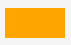
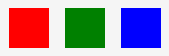
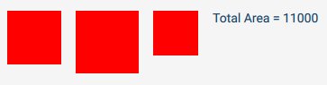
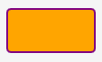
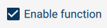
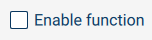
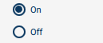
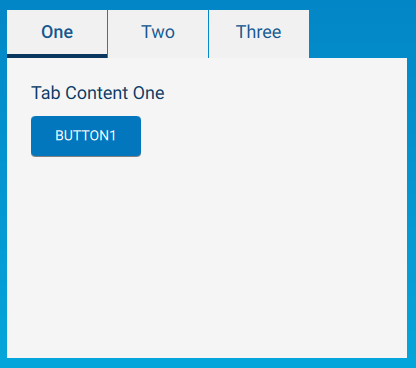

# YML

YML (Yaskawa Markup Language) is a cross-platform declarative language for easily describing user-interface components and their layout.

## Types

Each YML type represents a geometric element on the screen.  Many types are items that are visually rendered - such as Rectangles, Buttons, Text labels and so on.  Some types have no visual rendering but influence the layout of other items, such as Row and Column.

Each type has a set of properties used to control the look and behavior.  Most types also emit events in response to changes - such as manipulation by the user.  For example, the `Button` item emits a `Clicked` event when it is clicked by the user.

Types exist in a static inheritance tree, whereby each type inherits all the properties of its immediate super-type (ancestor).  For example, an `Item` is the ancestor of many visual types and has properties `width` and `height`.  Hence, all descendants of Item also have associated `width` and `height` properties.

By declaring an instance of a YML type in your interface, it creates a concrete instance of the type with concrete values for each of its properties (many of which may be default values of none are explicitly provided).

For example:

```qml
Rectangle {
    id: myrect
    width: 60
    height: 30
    color: "orange"
}
```



creates a concrete instance of a Rectangle to be rendered on the screen with the given values of the width and height properties.

Instances can be nested, creating dynamic parent-child relationships that dictate the order in which items are rendered on the screen.

For example:

```qml
Row {
    id: myrow
    Rectangle { width: 40; height: 40; color: "red" }
    Rectangle { width: 40; height: 40; color: "green" }
    Rectangle { width: 40; height: 40; color: "blue" }
}
```



creates three `Rectangle`s where the `Row` `myrow` is the parent of all three.  The behavior of `Row` is to position its children horizontally.

## Properties 

### Expressions 

The value supplied for a property, in addition to simple literal values, like `10` or `"red"`, can consist of expressions in a syntax very similar to Javascript.

Properties have a specific type - one of `bool`, `int`, `real` or `string`.  Each has a corresponding way to write a literal for that type:

  * `bool` - `true` or `false`
  * `int` - integers (32bit), including scientific notation: `10`, `-100`, `-3.4e8`
  * `real` - floating point values (IEEE754 double precision 64bits): `10.1`, `-0.001`
  * `string` - character strings enclosed in single or double quotes (Unicode UTF-8 encoding).  C-escape sequences are supported : `"red"`, `'今日は!'`, `"\n"`

Hence, a valid expression for a property value of type `int` (e.g. width) is `(20*3+(100-10))-1`.

As we saw above, each instance of a YML type can be given an `id`.  You can access the property of a specific instance by prefixing the property names with the id and a period: `myrow.width`.  Note that the property value need not have been explicitly supplied, as is the case above.  

Properties can be referenced in expressions: `myrow.width*3 + 10 - myrect.width`, for example.

### Declarations

It is also possible to declare new YML types, including new properties.  For example, suppose our UI used a lot of red squares and we wanted to avoid repeatedly using Rectangle and the color property for every instance:

```qml
RedSquare : Rectangle 
{    
    width: 50
    height: width
    color: "red"

    property int area: width*height
}

...

Row {
    id: rowofsquares
    RedSquare { id: s1; width: 60 } // override width
    RedSquare { id: s2; width: 70}
    RedSquare { id: s3 }
    Text { 
        text: "Total Area = "+(s1.area + s2.area + s3.area)
    }
}
```


Notice:
  * Our new `RedSquare` type inherits from `Rectangle` and hence inherits its properties and behavior as defaults
  * It declares a new property named `area`
  * Use of `//` C++-style single-line comments.  `/* ... */` C-style are also allowed.
  * Even though we override the `width`, the shape will still be square as the `height` of `RedSquare` is defined to be the `width`.  This makes use of a binding (described below).
  * Liberal automatic type conversion - the `int` expression for the areas was automatically converted to `string` to satisfy the `+` string concatenation operator

### Bindings

When we reference properties in an expression for the value of a property, the property is bound to the expression.  This means that changes in the values of referenced properties will be reflected in the property value.

For example, in `RedSquare`, any change, at run-time, of the width property will also change the height property because it is bound to width.  Bindings can be complex expressions, not just simple property references.

For example:

```qml
Rectangle {
    id: myrect
    width: 20
    height: 10
}

Text {    
    id: mytext
    text: "Area of myrect with margin of 10 is "+( (myrect.width+10) * (myrect.height+10))
}
```

will result in text being displayed that initially reads "Area of myrect with margin of 10 is 600", but will automatically update appropriately if the value of `myrect` `width` or `height` is assigned at run-time, because the expression for the property `text` is a binding that includes references to the myrect properties.

**Note**, however, if a property with a binding expression is explicitly assigned by extension code at run-time, the binding is lost and the last assigned value persists.  Hence, if your extension code assigned the value `"Hello, World"` to `mytext.text`, it will retain that value until explicitly reassigned regardless of myrect.


## Events

Events are how the UI signals to your extension the occurrence of various actions and activities happening on the UI during run-time.  The types of events emitted is specific to the YML type.  For example, `Button` emits `Pressed`, `Released` and `Clicked` events corresponding to when the button is touched, when the touch is released and if the touch-release sequence signified a 'click' (e.g. touch & release both over the button touch area and `Button` wasn't disabled etc.).


# YML Markup Reference

This section lists each of the supported YML types, along with its properties and events.  Inherited properties are not duplicated.

## YML Integration Types

  * [Utility](#utility)
  * [Panel](#panel)

----

### Utility

The type of all pendant Utility Window items.

Inherits: [Item](#item)

#### Properties 

  * `int margin` - the margin between the window border and content (optional; omit for default)
  * `bool expandCollapseResize` - if true, window as two sizes: *expanded* and *collapsed*, which can be toggled between via an icon in the title bar (default false)
  * `array collapsedSize` - [width,height] of the collapsed window size (default `[Const.HalfWidth, Const.QuarterHeight]`)
  * `array expandedSize` - [width,height] of the expanded window size (default `[Const.FullWidth,Const.HalfHeight]`)
  * `string expandBy` - when expanded, expand only `Const.Width`, `Const.Height` or `Const.Both` (default)
  * `string collapseBy` - when collapsed, collapse only `Const.Width`, `Const.Height` or `Const.Both` (default)
  * `bool continuousResize` - if true, a resize handle will be shows in the bottom-right of the window allowing users to resize the window arbitrarily
  * `array minSize` - [width,height] minimum window dimensions
  * `array maxSize` - [width,height] maximum window dimensions
  * `string theme` - `light` or `dark` (defaults to light)

#### Events

  * `UtilityOpened` - window was opened
  * `UtilityClosed` - window was closed
    <!--* `UtilityMoved` - window was moved while open (including resized)-->

----

### Panel

The type of all lower-screen detail panel items.

Inherits: [Item](#item)

#### Properties 

  * `int margin` - the margin between the panel edges and content (optional; omit for default)
  * `string theme` - `light` or `dark` (defaults to dark)

#### Events

  * `PanelOpened` - panel became visible
  * `PanelClosed` - panel became hidden

----

## YML Items

  * [Item](#item)
  * [Rectangle](#rectangle)
  * [Text](#text)
  * [Label](#label)
  * [TextField](#textfield)
  * [Button](#button)
  * [HelpButton](#helpbutton)
  * [CheckBox](#checkbox)
  * [RadioButton](#radiobutton)
  * [ComboBox](#combobox)
  * [Image](#image)
  * [Column](#column)
  * [Row](#row)
  * [Stack](#stack)
  * [TabBar](#tabbar)
  * [TabButton](#tabbutton)
  * [TabPanel](#tabpanel)
  * [MouseArea](#mousearea)

----

### Item

The ancestor of all geometric types (visual or not).

#### Properties

  * `int width` - the on-screen width
  * `int height` - the on-screen height
  * `int x` - the x coordinate (from left) relative to parent item
  * `int y` - the y coordinate (from top) relative to parent item
  * `bool visible` - is the item visible or hidden?

#### Events

  * `VisibleChanged` - change in the `visible` property

----

### Rectangle

A rectangle shape with the given dimensions and color.



Inherits: [Item](#item)

#### Properties 

  * `string color` - fills area with given color.  Accepts hex color descriptions, such as `"#ff0000"` or standard SVG color names, such as `"red"`, `"blue"` etc. Transparency can also be set by setting opacity in front of the hex color, such as`"#ff000000"`for 100% opacity and `"#00000000"` for 0% opacity, or the predefined color: "transparent"
  * `int radius` - radius of rounded corner (defaults to 0)
  * `string borderColor` - optional color of border 
  * `int borderWidth` - thickness of the border

#### Example

```qml
Rectangle {
    width: 100
    height: 50
    radius: 5
    color: "orange"
    borderColor: "purple"
    borderWidth: 2
}
```

----

### Text

Text as specified in selectable font and size.

Inherits: [Item](#item)

#### Properties

  * `string text` - the text to display
  * `string color` - text color
  * `string fontName` - name of font
  * `int fontSize` - text font size
  * `int fontWeight` - One of `Const.Normal`, `Const.Medium` or `Const.Bold`
  * `int valign` - vertical alignment within Item.  One of `Const.Top`, `Const.Center` (default), `Const.Bottom` (no effect unless height overridden as height defaults to height of text)
  * `int halign` - horizontal alignment within Item.  One of `Const.Left` (default), `Const.Center`, `Const.Right` (no effect unless width overridden as width defaults to width of text)
  * `int wrapMode` - `Const.NoWrap` (default) or `Const.Wrap`.  *Note:* if NoWrap, text may extend beyond the right edge of the Item (it is not clipped to the Item width).  If Wrap is used, an explicit width should be given, or the Text Item will expand to the width required (and hence not wrap the text).

#### Text Property

In addition to plain text, the text property also supports a limited subset of HTML for rich text.  Specifically, it allows use of the elements `h1` through `h6`, `p`, `pre`, `table` (and `tbody`,`td`,`th`,`thead`, `tr`), `ul`, `li`, `hr`, `i`, `b`, `u`, `sup`, `sub` and `a`.  The `html`, `body` and `head` elements are also supported for completeness, but not necessary.

For example:

```html
<h1>Heading</h1>
<p>A paragraph with <i>italic</i> and <b>bold</b> text and a link 
to the <a href='screen:home'>home screen</a>.
```
Notice that `<a>` hyper-links are supported and are primarily used to allow navigation to pendant screens.  See the [URI Links](#uri-links) for details.

#### Example

```qml
Text {
	id: textLinktoScreen
	text: "<a href=\"screen:toolSettings?toolnum=0&name=Default\">Go to Tools Screen</a>"
}
```

----

### Label

Text used as the label for a UI control.  Defaults to larger font size.

Inherits: [Text](#text)

----

### TextField

An field of text editable by the user.  When clicked/focused will cause the on-screen virtual keyboard or keypad to show.

#### Properties
  * `string text` - current value of the text field (defaults empty)
  * `string placeholderText` - placeholder text shown (lighter) prior to editing - hint to user what to enter
  * `string color` - color of the text
  * `int fontSize` - text font size
  * `string placeholderTextColor` - color of the placeholder text
  * `string label` - text label for the field (e.g. may be shown above the entry area)
  * `string units` - text for units (right-aligned in field)
  * `bool allowEmpty` - is empty entry acceptable?
  * `int minimumLength` - minimum acceptable entry length
  * `bool numericInput` - numeric entry?
  * `int decimalPlaces` - maximum number of decimal places (digits after `.`)
  * `real lowerBound` - minimum acceptable numeric value (if numericInput)
  * `real upperBound` - maximum acceptable numeric value (if numericInput)
  * `bool uppercaseInput` - only allow upper-case letters
  * `bool alphaInputOnly` - only allow alphabetic characters
  * `string allowedChars` - explicit list of allowed entry characters
  * `string keepControlVisible` - id of the YML object to keep visible while the keyboard is open
  * `int requiredMode` - one of `Const.Manual`, `Const.Auto` or `Const.Any` (default) - enabled if controller operation mode as specified
  * `int requiredServo` - one of `Const.On`, `Const.Off` or `Const.Any` (default) - enabled if controller servo power as specified
  * `string requiredAccess` - enabled if current pendant security access level is as specified.  `Const.[Monitoring|Operating|Editing|Managing|ManagingSafety]` 

#### Events
  * TextEdited - the text was edited by the user
  * EditingFinished - editing was finished by pressing Enter/Save or navigating away from the field (unfocus)
  * Accepted - Enter/Save was clicked after editing

----

### Button

Inherits: [Item](#item)

#### Properties

  * `string text` - the button label (inside the button)
  * `string shape` - one of `Const.Circle` or `Const.Rectangle` (default)
  * `string iconSource` - icon inside the button (optional)
  * `int iconWidth` - width of the icon, if specified
  * `int iconHeight` - height of the icon, if specified
  * `string color` - button text color
  * `string bgcolor` - button background color
  * `fontSize` - pixel font size for label
  * `bool checkable` - is this a toggle button? (toggles between checked and unchecked on each click) defaults to false.
  * `bool checked` - is the button initially checked (if checkable)
  * `string navlink` - when supplied, clicking the button will take the link action.  See [URI Links](#uri-links) for details.
  * `int requiredMode` - one of `Const.Manual`, `Const.Auto` or `Const.Any` (default) - enabled if controller operation mode as specified
  * `int requiredServo` - one of `Const.On`, `Const.Off` or `Const.Any` (default) - enabled if controller servo power as specified
  * `string requiredAccess` - enabled if current pendant security access level is as specified.  `Const.[Monitoring|Operating|Editing|Managing|ManagingSafety]` 

#### Events

  * `Clicked` - emitted after appropriate press & release
  * `Pressed` - the button was touched ('pushed down')
  * `Released` - the touch was released ('up')

----

### HelpButton

On-screen help information (appears via pop-up).  The file or file data must be registered though API `registerHTMLFile()` or `registerHTMLData()` functions prior to instantiation.

Inherits: [Item](#item)

#### Properties

  * `string title` - the title of the pop-up with help information
  * `string htmlSource` - the source file for help content in HTML format.  This is only a limited subset of HTML (see [Text text property](#text)).  Links can use pendant-specific protocol schemes (see [URI Links](#uri-links)) below.

#### Example

```qml
HelpButton {
    id: myhelpbutton
	title: "Help for My App"
    htmlSource: "MyRegisteredHelpFile.html"
}
```

If the html source is to be updated with arbitrary new data periodically at run-time, consider using a `data:` URI, which will only store the html in memory and not write it to disk.  In this case, since the html data will be passed over the API connection, html files should not updated at high frequency.

*Note: On the pendant, the UI can access html source files directly; however, if running the extension remotely during development, the Java client `registerHTMLFile()` function will read the file and pass the data to `registerHTMLData()` instead - so it will be sent over the API network connection and saved in a temporary file on the pendant.*

----

### CheckBox

A selectable option (binary checked/unchecked) with optional label text.

|Checked|Unchecked|
|--|:--:|
|||

#### Properties
  * `string text` - label text
  * `bool checked` - is the box checked?
  * `int requiredMode` - one of `Const.Manual`, `Const.Auto` or `Const.Any` (default) - enabled if controller operation mode as specified
  * `int requiredServo` - one of `Const.On`, `Const.Off` or `Const.Any` (default) - enabled if controller servo power as specified
  * `string requiredAccess` - enabled if current pendant security access level is as specified.  `Const.[Monitoring|Operating|Editing|Managing|ManagingSafety]` 

#### Events
  * CheckedChanged - the check box was checked or unchecked

#### Example

```qml
CheckBox {
    id: mycheckbox
    text: "Enable function"
}
```

----

### RadioButton

A selectable option (binary checked/unchecked) with optional label text. Typically used to select one option from a set of options.  When multiple radio buttons are under the same parent, only one of them can be checked at any given time.



#### Properties

  * `string text` - label text
  * `bool checked` - is the radio button checked?
  * `int requiredMode` - one of `Const.Manual`, `Const.Auto` or `Const.Any` (default) - enabled if controller operation mode as specified
  * `int requiredServo` - one of `Const.On`, `Const.Off` or `Const.Any` (default) - enabled if controller servo power as specified
  * `string requiredAccess` - enabled if current pendant security access level is as specified.  `Const.[Monitoring|Operating|Editing|Managing|ManagingSafety]` 

#### Events

  * CheckedChanged - the check box was checked or unchecked

#### Example

```qml
Column {
	RadioButton {
		id: onRadio
		text: "On"
		checked: true
    } 
	RadioButton {
		id: offRadio
		text: "Off"
	} 
}
```

------

### ComboBox

A set of options, one of which is selected.  Presented as a drop-down menu of options, showing the currently selected option.


#### Properties
  * `array options` - array/vector of strings - one for each option (defaults to the empty array `[]`)
  * `int currentIndex` - index of currently selected item from the ComboBox options
  * `int requiredMode` - one of `Const.Manual`, `Const.Auto` or `Const.Any` (default) - enabled if controller operation mode as specified
  * `int requiredServo` - one of `Const.On`, `Const.Off` or `Const.Any` (default) - enabled if controller servo power as specified
  * `string requiredAccess` - enabled if current pendant security access level is as specified.  `Const.[Monitoring|Operating|Editing|Managing|ManagingSafety]` 

#### Events
  * Activated - the user selected one of the options

#### Example

```qml
ComboBox {
    id: myselector
    width: 200
    options: ["AAA", "BBB", "CCC"]
}
```

----

### Image

On-screen image.  The file or file data must be registered though API `registerImageFile()` or `registerImageData()` functions prior to instantiation.

Inherits: [Item](#item)

#### Properties

  * `string source` - reference to previously registered image name (preferred), or data: URI of PNG or JPEG binary data
  * `int fillMode` - one of:
    * `Const.Stretch` - the image is scaled to fit (the default)
    * `Const.PreserveAspectFit` - the image is scaled uniformly to fit without cropping
    * `Const.PreserveAspectCrop` - the image is scaled uniformly to fill, cropping if necessary
    * `Const.Tile` - the image is duplicated horizontally and vertically
    * `Const.TileVertically` - the image is stretched horizontally and tiled vertically
    * `Const.TileHorizontally` - the image is stretched vertically and tiled horizontally
    * `Const.Pad` - the image is not transformed

#### Example

```qml
Image {
    id: myimage
    width: 200
    source: "MyRegisteredImage.png"
    fillMode: Const.PreserveAspectFit // maintain aspect (while fitting width)
}
```

If the image source is to be updated with arbitrary new data periodically at run-time, consider using a `data:` URI, which will only store the image in memory and not write it to disk.  In this case, since the image data will be passed over the API connection, images should be kept small and not updated at high frequency.

*Note: On the pendant, the UI can access image source files directly; however, if running the extension remotely during development, the Java client `registerImageFile()` function will read the file and pass the data to `registerImageData()` instead - so it will be sent over the API network connection and saved in a temporary file on the pendant.*

----

### Column

Arranges child items vertically.

Inherits: [Item](#item)

#### Properties

  * `int spacing` - vertical space between children (default 0)
  * `align` - alignment of child elements.  One of `Const.Left`, `Const.Center` or `Const.Right`

----

### Row

Arranges child items horizontally.

Inherits: [Item](#item)

#### Properties

  * `int spacing` - horizontal space between children (default 0)
  * `align` - alignment of child elements.  One of `Const.Top`, `Const.Center` or `Const.Bottom`

----

### Stack

Arranges child items on top of each other, such that only the top one is visible, according to the `currentIndex`.

Inherits: [Item](#item)

#### Properties

  * `int count` - the number of child  Items (read only)
  * `int currentIndex` - the currently selected content item 

----

### TabBar

Container for TabButton Items for each clickable tab of a TabPanel navigation stack.  See [TabPanel](#tabpanel) for an example.

Inherits: [Item](#item)

#### Properties 

  * `int currentIndex` - index of currently selected tab (associated [TabPanel](#tabpanel) `currentIndex` typically bound to this property)

----

### TabButton

The clickable tab button that causes its associated tab panel to be shown.  See [TabPanel](#tabpanel) for an example.

Inherits: [Item](#item)

#### Properties 

  * `string text` - the text to display as the tab label
  * `string color` - tab button label text color

#### Events

  * `Clicked` - emitted when clicked (pressed & released).  Will set the parent [TabBar](#tabbar) `currentIndex` appropriately.

----

### TabPanel

Set of Items, one per tab content.  These are arranged as a stack so that only one content item is visible at a time.

*Note:* The default tab panel background is light colored, so contained items will use the 'light' theme (even if the TabPanel
itself is on a 'dark' themed Item such as [Panel](#panel)).

{:width="320px"}

Inherits: [Item](#item)

#### Properties 

  * `item bar` - the id of the TabBar item used to select the visible tab content
  * `int count` - the number of child tab content Items (read only)
  * `int currentIndex` - the currently selected content item (set automatically from the TabBar)

#### Example

```qml
Column { 
    spacing: 0 // ensure TabBar directly above TabPanel
    TabBar {
        id: mytabbar                
        // useful to have TabButton ids to hook Clicked events to know when
        //  tabs are selected
        TabButton { id: tab1; text: "One" }
        TabButton { id: tab2; text: "Two" }
        TabButton { id: tab3; text: "Three" }
    }

    TabPanel {
        bar: mytabbar  // content selected by this referenced TabBar              
        width: 400
        height: 300

        Column {
            Label { text: "Tab Content One" }
            Button { text: "button1" }
        }
        Column {
            Label { text: "Tab Content Two" }
            Button { text: "button2" }
        }
        Column {
            Label { text: "Tab Content Three" }
            Button { text: "button3" }
        }

    }
}
```


### MouseArea

An invisible rectangular area that can respond to mouse clicks.  For example, this may be used to position over sections on an image to capture clicks on specified areas of an image.  Place it deeper in the item heirarchy to position it over earlier/shallower items.  Mouse events are not passed through when enabled, so other items, like Buttons, below it will not receive clicks.

Inherits: [Item](#item)

#### Properties 

  * `bool enabled` - if true, mouse(touch) events will be captured and events generated; if false, mouse(touch) events will pass through as if no item was present
  
#### Events

  * `Clicked` - emitted when clicked (pressed & released) if enabled.


## URI Links

In places where URI links can be specified, such as the `Button` `navlink` property, `Text` HTML text `<a href>` and within Help HTML files, the following pendant-specific URI schemes may be used.

The custom URI protocol `screen:` will create a hyper link that, when clicked, navigates to the specified pendant screen.  The supported screens are: `home`, `jobList`, `programmingView`, `toolSettings`, `userFrameSetting`, `zoneSettings`, `homePosition`, `backup`, `shockDetectionSetting`, `alarmHistory`, `IO`, `ioAllocation`, `variables`, `safetyLogicCircuit`, `settings`, `controllerSettings`, `support`, `blockIO`, `packageManagement`, `log`

Some screens may also support the setting of some fields. 

- Tools: `screen:toolSettings`
  - *toolnum* - tool number to be set (also selects it in the list)
  - *name* - tool name to be set
  - *blockio* - name of Block I/O setting to select 
  - *xf*, *yf*, *zf* - Tool Center Point (TCP) (mm)
  - *rx*, *ry*, *rz* - Tool Orientation (degrees)
  - *weight* - Tool Weight (kg)
  - *xg*, *yg*, *zg* - Center of Gravity (mm)
  - *ix*, *iy*, *iz* - Moment of Inertia
- Package Management: `screen:packageManagement`
  - *tab* - select tab; one of `packages`, `extensions` or `presets`
- Current Job: `screen:programmingView`
  - *panel* - select navigation panel (one of `IO`, `variables`, `jogging`, `commands`, or `testjob`)
  - *jobname* - open the specified job (if it exists)
  - *jogmode* - set the jogging mode (required Manual/Teach operation) one of `smartframe`, `joint`, `xyzworld`, `xyztool`, `xyzuser` or `handguiding`
    * *framenum* - (`xyzuser` only) user-frame number to select for jogging coordinate frame
    * *toolnum* - (`xyztool` only) tool number to be active for TCP/tool-tip jogging coordinate frame
  - *goto* - open Goto Position Popup (only if panel is `jogging`) one of `joint`, `trans`, `orient` or `pos`.
    * *joint* - is implied if and only if jogmode is `joint`
      * *j0*,*j1*, ... *j5* - specify joint angles in degrees (fills in fields, no motion is activated)
      * *s*, *l*, *u*, *r*, *b* and *t* - aliases for joint angles (as labeled on Jogging screen)
    * *trans* - X, Y and Z fields shown for setting TCP/tool-tip position
      * *x*, *y*, *z* - TCP/tool-tip (X,Y,Z) coordinates in mm.
    * *orient* - Rx, Ry and Rz fields shown for setting TCP/tool-tip orientation
      * *rx*, *ry*, *rz* - TCP/tool-tip orientation in degrees.
    * *pos* - X, Y, Z, Rx, Ry and Rz fields shown for setting TCP/tool-tip position & orientation
      * *x*, *y*, *z*, *rx*, *ry*, *rz* - as above  
  - Example: `screen:programmingView?panel=jogging&jogmode=xyzuser&framenum=5&goto=pos&x=10&y=20&z=30.5&rx=70&ry=90.1&rz=-30.5` 
    will navigate to the programming view, select the Jogging panel, switch to User Frame 5 as the jogging coordinate frame of reference,
    open the Goto Position popup with X,Y,Z,Rz,Ry and Rz fields visible and pre-filled with the supplied values.
- User Frame Settings `screen:userFrameSetting`   
  - *framenum* - the user frame number to select in the list
